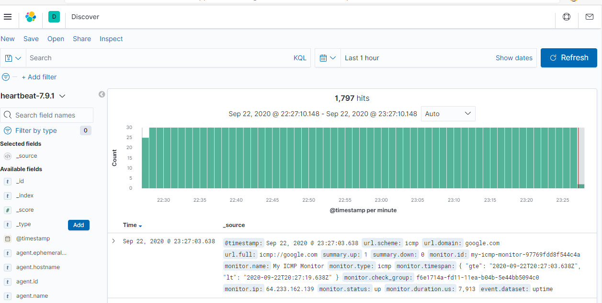
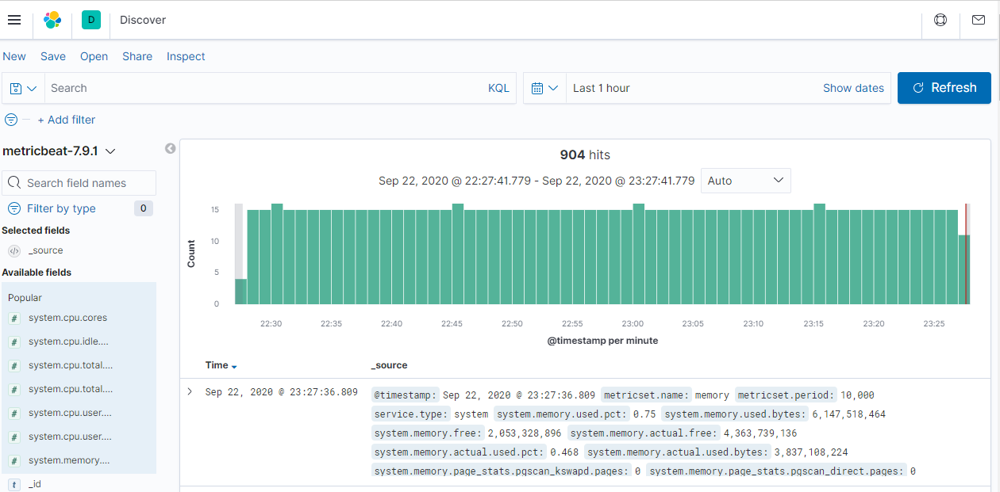
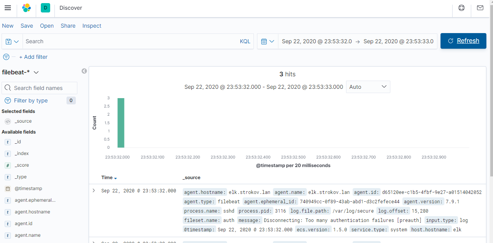

# Установка beats
Цель: Для успешного выполнения дз вам нужно сконфигурировать hearthbeat, filebeat и metricbeat.

Heartbeat должен проверять доступность следующих ресурсов: otus.ru, google.com.

Metricbeat должен формировать метрики на основе показателей загрузки процессора и оперативной памяти.

Filebeat должен собирать логи ssh сервера. По собственному усмотрению вы можете собирать логи других сервисов которые присутствуют в системе ^_^

В качестве результата приложите конфиги hearthbeat, filebeat и metricbeat. Скриншот полученных данных отображенных в Kibana.

Выполняем от рута или используем механизм sudo.

1. Устанавливаем metricbeat
```bash
rpm -ivh https://artifacts.elastic.co/downloads/beats/metricbeat/metricbeat-7.9.1-x86_64.rpm
```
2. Устанавливаем filebeat
```bash
rpm -ivh https://artifacts.elastic.co/downloads/beats/filebeat/filebeat-7.9.1-x86_64.rpm
```
3. Устанавливаем heartbeat
```bash
rpm -ivh https://artifacts.elastic.co/downloads/beats/heartbeat/heartbeat-7.9.1-x86_64.rpm
```

Настраиваем heartbeat


Проверяем настройки 
```bash
heartbeat setup -e
```
Если все ок запускаем 
```bash
service heartbeat-elastic start
```

Идём в elasticsearch и проверяем наличие индекса heartbeat. 
Добавляем индекс паттерн для нового индекса.

Смотрим результат.


Аналогично настраиваем metricbeat

Смотрим результат.



Устанавливаем filebeat

Добавляем строки в /etc/rsyslog.d/sshd.conf

```plaintext
:programname, isequal, "sshd" /var/log/sshd.log
:programname, isequal, "sshd" stop[root@work rsyslog.d]
```
Этим мы перенаправляем логи sshd в отдельный файл.


Разрешаем использовать модуль system
```bash
filebeat modules  enable system
```

Добавляем строку в /etc/filebeat/modules.d/system.yml
```plaintext
    var.paths: ["/var/log/sshd.log"]
```
Так чтобы отправлялась информация только из sshd.log.


Тестируем конфиг 
```bash
filebeat test config
```
Перезапускаем filebeat
```bash
service filebeat restart
```
Прверяем вывод логов. Пробуем залогиниться на сервере по ssh.

Смотрим результат в elasticsearch.



